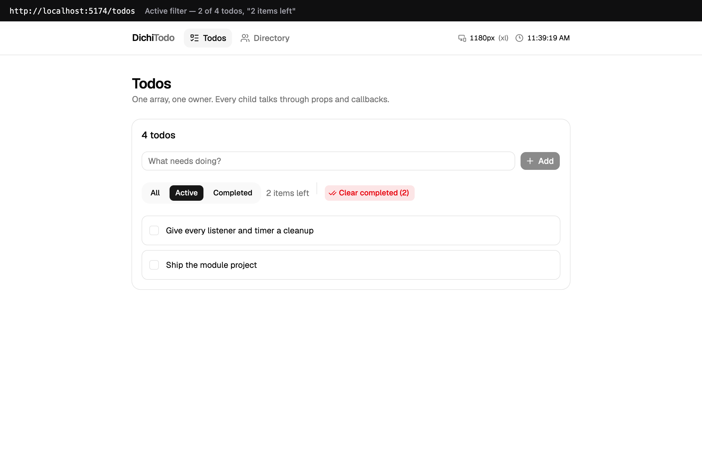
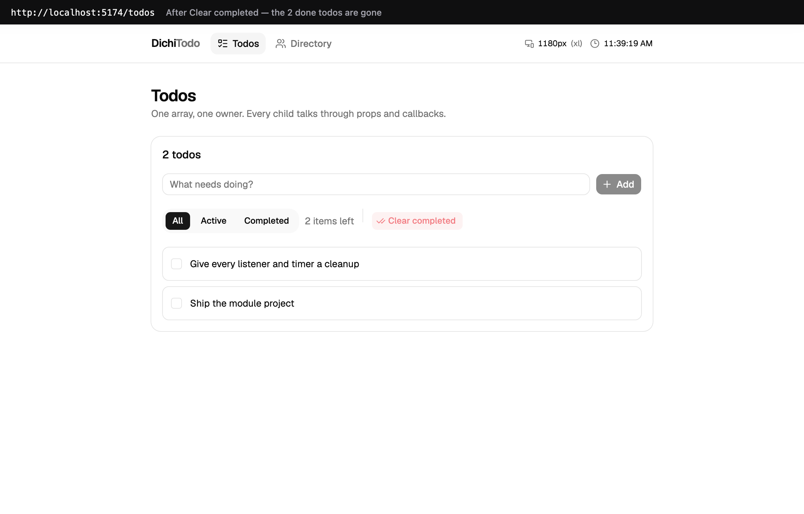
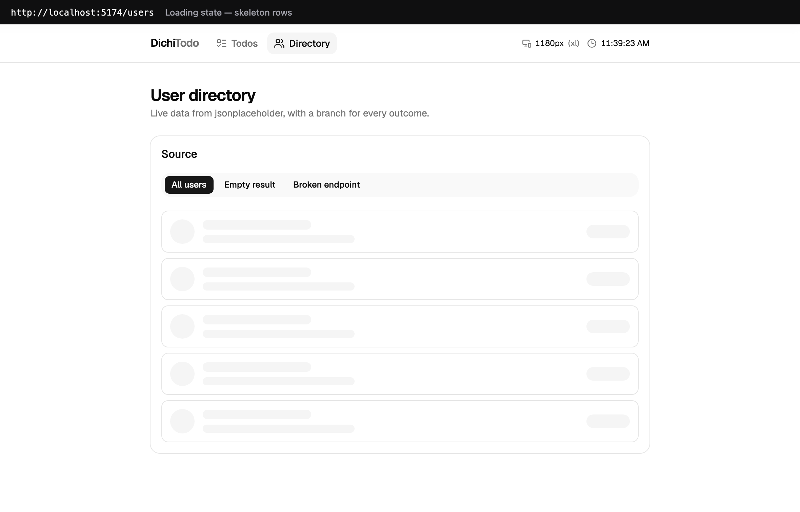
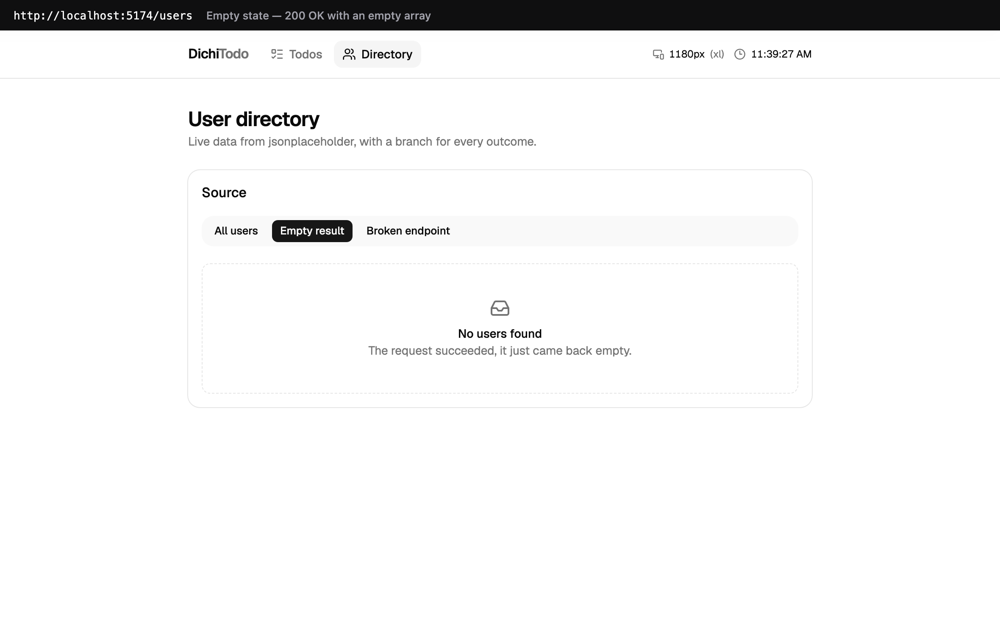
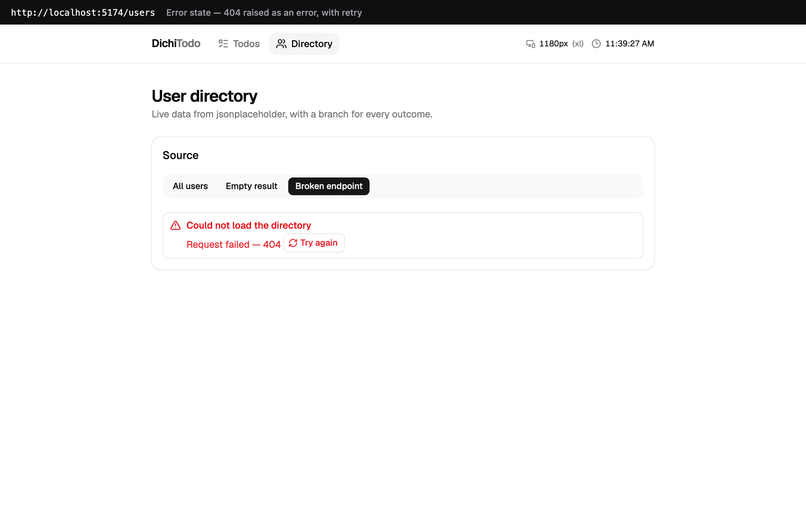
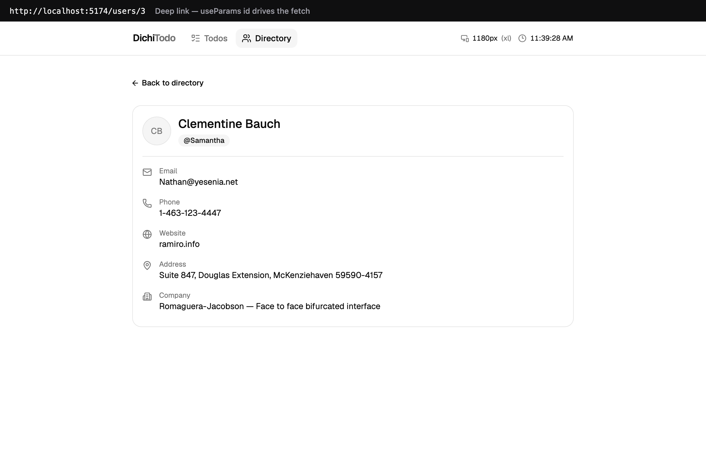
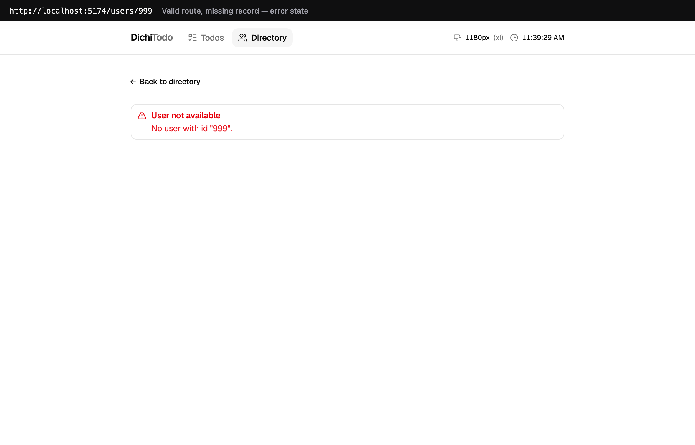
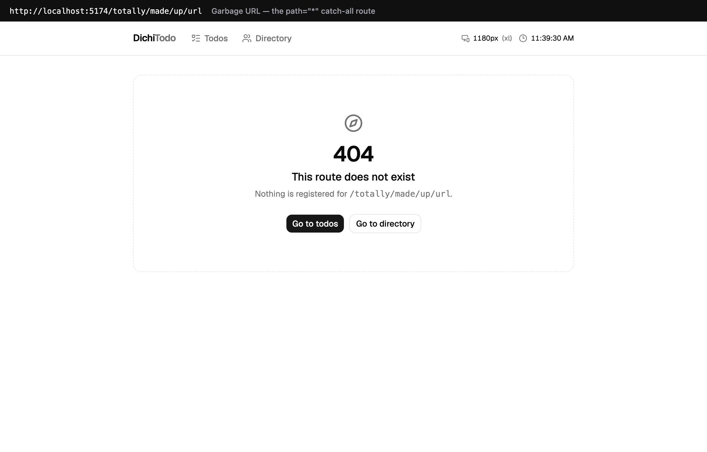

# DichiTodoApp

A React 19 app for the state / effects / data-fetching / routing module: one
owner for shared state, effects that clean up after themselves, fetches that
survive race conditions, and a route for every view.

**Stack:** React · TypeScript · Vite · Tailwind CSS · shadcn/ui · React Router · ESLint

## Running it

```bash
npm install
npm run dev
```

Then open the printed URL. Other scripts: `npm run lint`, `npm run typecheck`,
`npm run build` (which typechecks first), `npm run preview`.

## Routes

| Path | View |
| --- | --- |
| `/` | redirects to `/todos` |
| `/todos` | the todo list |
| `/users` | the user directory |
| `/users/:id` | one user, read from the URL with `useParams` |
| `/shop` | the catalog, with the buttons that dispatch cart actions |
| `/checkout` | the cart lines and the order summary |
| `*` | 404 catch-all |

Navigation is `Link` / `NavLink` only, so moving between pages never reloads the
page and the header's clock keeps ticking straight through.

## 1. Lifted state

`src/pages/TodosPage.tsx` owns the todo array and the active filter. Nothing
else does.

```
TodosPage  ← owns todos + filter
├── AddTodo     onAdd(text)
├── FilterBar   filter, activeCount, completedCount → onFilterChange, onClearCompleted
└── TodoList    todos (already filtered) → onToggle, onDelete
    └── TodoItem
```

Every child is stateless with respect to the todos: values go **down** as props,
intent comes **back up** as callbacks. `AddTodo` keeps the text currently typed
into its own input, which is private UI state, not shared state.

The visible list, the "items left" counter and the completed count are all
**derived during render** from the one array — never stored in a second piece of
state that could drift.

`Clear completed` lives in `FilterBar` but the array it clears lives in
`TodosPage`; the button just calls `onClearCompleted()`.




## 2. Effects, and what each cleanup prevents

| Effect | Deps | Cleanup | One sentence |
| --- | --- | --- | --- |
| `LiveClock` — ticking clock | `[]` | `clearInterval` | Prevents the 1-second interval from outliving the component and calling `setState` on something React has already unmounted. |
| `WindowWidth` — live width readout | `[]` | `removeEventListener` | Prevents a new `resize` listener being added to `window` on every mount with none ever removed, so old listeners pile up and fire into dead components. |
| `useFetch` — every request in the app | `[url, reloadKey]` | `cancelled = true` + `controller.abort()` | Prevents a slow response for a URL you have already moved away from landing late and overwriting the data you are actually looking at. Both fetching pages share this one effect. |

Both `[]` dependency lists are honest: those effects read nothing from props or
state, they only subscribe. `react-hooks/exhaustive-deps` is configured as an
**error** in `eslint.config.js`, so a missing dependency fails the lint run.

Navigating the whole app produces zero console warnings or errors.

## 3. The fetch, and its four states

`src/pages/UsersPage.tsx` renders every outcome of a real request to
`jsonplaceholder.typicode.com`. The three buttons at the top pick a real
endpoint, so no state is faked:

| State | How it is reached |
| --- | --- |
| **Loading** | skeleton rows in the shape of the real rows, so nothing jumps on arrival |
| **Loaded** | `GET /users` → 10 users |
| **Empty** | `GET /users?id=0` → `200 OK` with `[]` — the request worked, there is just nothing in it |
| **Error** | `GET /users/not-a-real-path` → `404`, raised by hand because `fetch` only rejects on network failure |






### Surviving the race

Since the TypeScript move this lives in `src/hooks/useFetch.ts` rather than in
each page, but it is the same guard:

```ts
useEffect(() => {
  let cancelled = false
  const controller = new AbortController()

  async function loadUsers() {
    setStatus('loading')
    try {
      const response = await fetch(url, { signal: controller.signal })
      if (!response.ok) {
        throw new Error(`Request failed — ${response.status} ${response.statusText}`)
      }
      const data = await response.json()
      if (cancelled) return        // ← a response from a run we moved on from
      setUsers(data)
      setStatus('success')
    } catch (requestError) {
      if (cancelled || requestError.name === 'AbortError') return
      setError(requestError.message)
      setStatus('error')
    }
  }

  loadUsers()
  return () => {
    cancelled = true
    controller.abort()
  }
}, [url, reloadKey])
```

Switch sources twice quickly and two requests are in flight at once. Without the
flag, whichever answered *last* would win and paint the wrong list. `abort()`
stops the request; `cancelled` still matters because a response can already be
resolving by the time the cleanup runs.

## 4. Routing

`src/App.tsx` holds the whole route table. `/users/:id` reads its id with
`useParams` and that id is the effect's only dependency — change the URL and the
fetch re-runs, stay put and it does not.

Opening `/users/3` directly works, because the id comes from the URL rather than
from something a previous page handed over:



A valid route with a record that does not exist is an error state, not a crash:



Anything that matches no route at all hits `path="*"`:



## 5. `useFetch<T>` — one generic async state machine

`src/hooks/useFetch.ts`. A `useReducer` over a three-state union, returning the
flat triple callers actually want:

```ts
type FetchState<T> =
  | { status: 'loading' }
  | { status: 'success'; data: T }
  | { status: 'error'; error: string }

export function useFetch<T>(url: string, reloadKey = 0): {
  data: T | null
  loading: boolean
  error: string | null
}
```

Each state carries exactly the data that state has. There is no
`{ loading: true, data: …, error: … }` to reason about, because the union
cannot describe one — that is what "typed state machine" buys you.

Both fetching pages instantiate it with a different `T`:

```ts
const { data: users, loading, error } = useFetch<User[]>(url, attempt)   // UsersPage
const { data: user,  loading, error } = useFetch<User>(userUrl)          // UserDetailPage
```

**Confirming it narrows.** Not by reading it — by making the compiler object.
Temporarily writing this into the tree:

```ts
const { data } = useFetch<User[]>('/x')
data.length                        // error TS18047: 'data' is possibly 'null'
if (data) data.map((u) => u.nmae)  // error TS2339: Property 'nmae' does not exist on type 'User'
if (data) data.map((u) => u.name)  // fine
```

`data` is `User[] | null` and its elements are `User`. The hook itself never
imported `User`; the call site named the shape once and the compiler carried it
the rest of the way.

`reloadKey` is an optional second argument, there only so the "Try again"
button can re-run an unchanged URL. It does not change the returned shape.

## 6. `AuthContext` — the end of prop drilling

Three files, so that each one exports either components or values and
`react-refresh` stays happy without an eslint-disable:

| File | What is in it |
| --- | --- |
| `src/context/auth-context.ts` | `AuthUser`, `AuthContextValue`, `createContext` |
| `src/context/AuthProvider.tsx` | the one owner of `user`, wrapping the app in `main.tsx` |
| `src/hooks/useAuth.ts` | the consumer hook |

The context default is `null`, and it means **"there is no provider above me"** —
deliberately not the same value as "signed out", which is `user: null` *inside*
a real context value. `useAuth` throws on the first case, so its return type is
`AuthContextValue` and never `| null`; no caller ever null-checks `signIn`.

`NavBar` is a sibling of the pages, not a child of anything that knows about
auth, and it still renders **"Sign in"** or **"Hi, {user.email}"** — because it
calls `useAuth()` instead of waiting for a `user` prop to be threaded down to
it. Whether the little sign-in form is open, and the text typed into it, stay
as local state in `NavBar`: private UI state is not shared state.

## 7. `CartContext` — every rule in one pure function

`src/context/cart-context.ts` holds the discriminated union and the reducer:

```ts
export type CartAction =
  | { type: 'ADD_ITEM';        payload: { product: Product } }
  | { type: 'REMOVE_ITEM';     payload: { id: string } }
  | { type: 'UPDATE_QUANTITY'; payload: { id: string; quantity: number } }
```

`type` is the discriminant, and each arm carries its own payload and no other:
`REMOVE_ITEM` has no `quantity` field to set, and there is no `SET_ITEMS` arm
that would let a component hand the reducer a line it built itself. Those three
arms are the cart's entire surface area, checked at compile time.

`cartReducer` owns the rules, and the components own none of them:

| Action | Rule |
| --- | --- |
| `ADD_ITEM` | a product already in the cart bumps its quantity — one line of two, not two lines |
| `REMOVE_ITEM` | drop the line |
| `UPDATE_QUANTITY` | **at or below zero, the line leaves the cart**; otherwise set it |

Dispatched from real buttons: "Add to cart" on `/shop`, and `−` / `+` / bin on
`/checkout`. Pressing `−` at quantity 1 sends `quantity: 0` and the line
disappears. The button does not know that rule — it reports what happened and
the reducer decides what the cart becomes.

### The checkout summary reads the cart via `useContext`

`src/components/cart/CheckoutSummary.tsx` **takes no props.** It sits inside a
card inside `CheckoutPage`, several levels below `CartProvider`, and nothing in
between knows the cart exists. `CartLines` is the same: no props, and its rows
are rendered inline rather than handed to a `<CartLine item={…} />` child,
because that prop would be cart data travelling down the tree.

Grep the whole `src/` tree for a component rendered with a cart-shaped prop and
the only hit is the comment explaining why there isn't one:

```
$ grep -rE '<[A-Z][A-Za-z]*[^>]*\b(items|item|cart|quantity|subtotal|total|line)=' src --include='*.tsx'
src/components/cart/CartLines.tsx:10: * `<CartLine item={…} />` child, because that prop would be cart data
```

Item count, subtotal, shipping and total are all derived during render from
`items`. None is stored, so none can drift.

### One sentence, as asked

> An item with quantity `-1` is unrepresentable because the discriminated union
> makes `UPDATE_QUANTITY` the only action that can touch a quantity, so every
> change to one is funnelled through the single `cartReducer` branch that
> deletes the line at anything `<= 0` — and no component has another door
> through which to put a number into `CartItem.quantity`.

### Screenshots

Screenshots for this module are **not committed** — they ship zipped alongside
the hand-in (`Context&Reducers.zip`), and `*.zip` is in `.gitignore`.

## Audit checklist

- [x] Shared state lives in ONE component — `TodosPage` owns the array; children are stateless
- [x] Every effect lists only the values it reads — `exhaustive-deps` is an error, lint passes
- [x] Cleanup on every listener and timer — interval, resize listener, and both fetches
- [x] Navigating between pages never crashes — verified across every route, including deep links and garbage URLs
- [x] Fetch renders loading, error, empty and data
- [x] Race conditions guarded with a `cancelled` flag
- [x] `useFetch<T>` is generic — `useFetch<User[]>` narrows `data` to `User[] | null`, confirmed by forcing TS18047 and TS2339
- [x] `AuthContext` with `signIn(email)` / `signOut()`, a provider at the root, and a NavBar showing "Sign in" or "Hi, {user.email}"
- [x] `CartContext` on `useReducer` with a discriminated-union `CartAction` — ADD_ITEM, REMOVE_ITEM, UPDATE_QUANTITY (0 removes the line), dispatched from real buttons
- [x] Checkout summary reads the cart via `useContext`; no prop carries cart data anywhere in the tree
